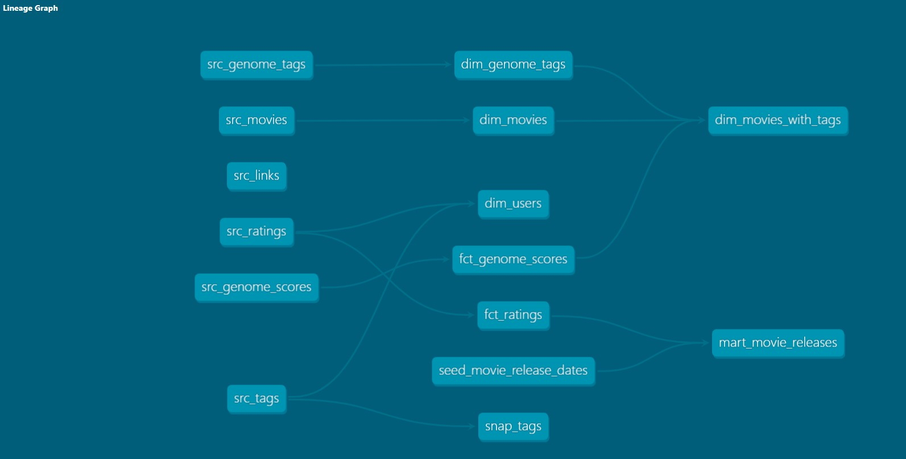

# MovieLens DBT ELT Pipeline

A production-style ELT pipeline built with **dbt** on **Databricks**, transforming the [MovieLens ml-20m](https://grouplens.org/datasets/movielens/) dataset into a clean, analytics-ready dimensional model.


## Overview

This project ingests raw MovieLens data from Databricks (`movielens.raw`), applies a layered transformation strategy (staging → dimensions & facts → marts), and exposes clean analytical tables ready for BI tooling or further analysis.

Key design principles:
- **Layered architecture**: raw → staging → dim/fct → mart
- **Dimensional modelling**: star-schema with reusable dimension and fact tables
- **Data quality**: dbt tests (not_null, relationships) on all key columns
- **Snapshot tracking**: SCD Type 2 snapshot on user tags via `dbt-utils` surrogate keys
- **Seed enrichment**: movie release dates loaded via a seed file


## Dataset

**Source**: [MovieLens ml-20m](https://grouplens.org/datasets/movielens/) — GroupLens Research, University of Minnesota

| File | Description |
|---|---|
| `movies.csv` | 27,278 movies with titles and genres |
| `ratings.csv` | 20,000,263 ratings (0.5–5 stars) by 138,493 users |
| `tags.csv` | 465,564 free-text tag applications |
| `genome-scores.csv` | Tag relevance scores per movie (0–1) |
| `genome-tags.csv` | 1,128 genome tag labels |
| `links.csv` | IMDB / TMDB cross-reference IDs |


## Project Structure

```
MovieLensDBT/
├── data/                         # Raw CSV source files (ml-20m)
├── movielens_dbt/
│   ├── dbt_project.yml           # Project configuration
│   ├── packages.yml              # dbt package dependencies
│   ├── models/
│   │   ├── schema.yml            # Model descriptions & column tests
│   │   ├── staging/              # Thin wrappers over raw source tables
│   │   ├── dim/                  # Dimension tables (materialized as tables)
│   │   ├── fct/                  # Fact tables (materialized as tables)
│   │   └── mart/                 # Business-layer mart models
│   ├── analyses/
│   │   └── movie_analysis.sql    # Ad-hoc analytical queries
│   ├── seeds/
│   │   └── seed_movie_release_dates.csv
│   ├── snapshots/
│   │   └── snap_tags.sql         # SCD Type 2 snapshot on user tags
│   └── tests/                    # Custom data tests
└── pyproject.toml
```

## Lineage Graph
<br>
<br>

<br>
<br>


## Data Architecture

```
    S3 SOURCE FILES
        │
        ▼
Raw Layer (Databricks)
  movielens.raw.*
        │
        ▼
Staging Layer  (views)
  src_movies · src_ratings · src_tags
  src_genome_scores · src_genome_tags · src_links
        │
        ▼
Dimensional Layer  (tables)
  ┌─────────────────────────────────────────────┐
  │  dim_movies          dim_users              │
  │  dim_genome_tags     dim_movies_with_tags   │
  │  fct_ratings         fct_genome_scores      │
  └─────────────────────────────────────────────┘
        │
        ▼
Mart Layer  (table)
  mart_movie_releases
        │
        ▼
Seeds / Snapshots
  seed_movie_release_dates · snap_tags (SCD2)
```


## Models

### Staging (`views`)
Thin, renaming-only wrappers over raw Databricks source tables — no business logic applied here.

| Model | Source Table |
|---|---|
| `src_movies` | `movielens.raw.movies_raw` |
| `src_ratings` | `movielens.raw.ratings_raw` |
| `src_tags` | `movielens.raw.tags_raw` |
| `src_genome_scores` | `movielens.raw.genome_scores_raw` |
| `src_genome_tags` | `movielens.raw.genome_tags_raw` |
| `src_links` | `movielens.raw.links_raw` |

### Dimensions (`tables`)

| Model | Description |
|---|---|
| `dim_movies` | Cleaned movie metadata — standardised titles, genre arrays |
| `dim_users` | Deduplicated user IDs from ratings and tags |
| `dim_genome_tags` | Cleaned genome tag labels |
| `dim_movies_with_tags` | Movies enriched with genome tag scores |

### Facts (`tables`)

| Model | Description |
|---|---|
| `fct_ratings` | 20M+ user–movie ratings with timestamps |
| `fct_genome_scores` | Tag relevance scores (0–1) per movie–tag pair |

### Mart (`table`)

| Model | Description |
|---|---|
| `mart_movie_releases` | Ratings joined with seed release dates; flags known/unknown release info |

### Snapshot

| Snapshot | Strategy | Description |
|---|---|---|
| `snap_tags` | Timestamp (SCD Type 2) | Tracks historical changes to user tag applications using a `dbt_utils` surrogate key |


## Analyses

[`analyses/movie_analysis.sql`](movielens_dbt/analyses/movie_analysis.sql) contains ready-to-run analytical queries:

- **Top-rated movies** — movies with ≥ 100 ratings ranked by average score
- **Rating distribution by genre** — average rating and movie count per genre
- **User engagement** — top 20 most active users and their average given rating
- **Release trends over time** — movie count by release year
- **Tag relevance analysis** — top 20 most relevant genome tags across all movies


## Key Features:
- Layered architecture — staging → dimensions & facts → business marts
- Comprehensive data quality testing — not_null and relationship validations across all key columns
- SCD Type 2 snapshots — tracks historical changes to user tags using dbt_utils surrogate keys
- Seed-based enrichment — loads movie release dates to enrich rating facts
- Interactive documentation — auto-generated dbt docs with DAG lineage graphs
- 20M+ ratings across 27K movies from 138K users — real-world scale analytics data
- Production-grade SQL patterns — optimized queries and reproducible transformations


